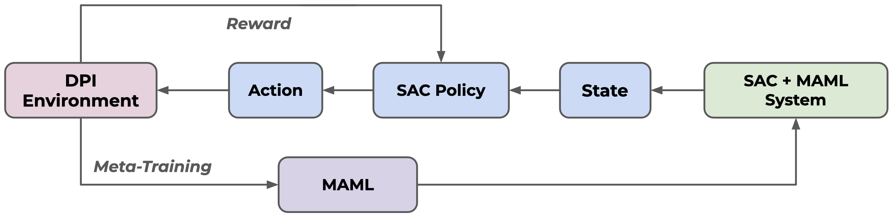
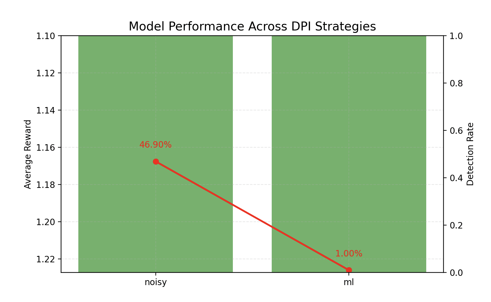

# Adversarial AI for VPN Obfuscation: Evading ML-Based Censorship Using SAC & MAML

**Overview**
This project implements a custom reinforcement learning environment for VPN traffic obfuscation, designed to evade a variety of Deep Packet Inspection (DPI) strategies. It trains a Soft Actor-Critic (SAC) agent to learn how to modify packet timing (jitter) and packet size in order to minimize detection. The environment simulates both rule-based and machine learning-based DPI adversaries, allowing for robust evaluation of the agent's adaptability. The framework also supports a simplified meta-learning loop via a "meta-training" script, which iteratively adapts the agent to new DPI strategies. **Note:** This project does not use the full Model-Agnostic Meta-Learning (MAML) algorithm, but rather a simplified loop to test the agent's ability to adapt.

**Project Goals**

- Simulate rule-based and noisy DPI environments
- Train a reinforcement learning agent using SAC
- Add meta-learning with MAML for adaptability to evolving censorship strategies
- Evaluate performance across different DPI heuristics
- Visualize detection rates and average rewards across environments

_Figure: Approach for the VPN Obfuscation RL Environment and DPI interaction._

**Repository Structure**

- `rl/`: Reinforcement learning logic and environment
  - `vpn_env.py`: Custom Gymnasium environment for VPN obfuscation
  - `sac_maml_trainer.py`: SAC training script
  - `sac_maml_vpn.py`: MAML meta-learning script for adaptability
- `dpi/`: DPI logic and simulated detection models
  - `mock_dpi.py`: Heuristic detection rules for DPI
  - `train_dpi_ml.py`: Script to train a machine learning-based DPI classifier (Random Forest) on processed data
  - `data/`: Data for DPI (used by packet_features or ML-DPI)
    - `sample_combined_balanced.csv`: Example CSV dataset for DPI/ML classifier
  - `models/`: Machine learning classifiers for DPI logic (e.g., .pkl files)
- `scripts/`: Run and evaluate experiments
  - `evaluate_policy.py`: Evaluate trained agent across DPI strategies
- `models/`: RL agent checkpoints 
- `logs/`: TensorBoard logs
- `test_env.py`: Simple script to test environment behavior with random agent
- `README.md`: Project overview and documentation
- `requirements.txt`: Python dependencies

**How to Run**

- Install Dependencies: `pip3 install -r requirements.txt`
- Train the SAC agent: `PYTHONPATH=. python3 rl/sac_maml_trainer.py`
- Evaluate Performance: `PYTHONPATH=. python3 scripts/evaluate_policy.py`

**Model Inputs and Actions**

- `State Representation`: What the agent observes at each step
  - Mean packet latency (proxy for network delay)
  - Packet size variation (traffic variability)
  - Recent detection flag (whether the last step was detected by DPI)
  - Packet size entropy (captures variability/unpredictability)
- `Action Space`: What the agent can control
  - Delay to introduce (jitter) (in ms)
  - Packet size adjustment (in bytes)

**Evaluation Metrics**

- Average reward per step
  - Measures the agent's overall performance, balancing evasion, latency, and penalties.
  - Higher values indicate better evasion and efficiency.
- DPI detection rate across strategies
  - The fraction of steps where the agent is detected by DPI (lower is better).
  - This is reported for each DPI strategy (e.g., "noisy", "ml").
- Adaptability under noisy or strict detection rules
  - Assesses how well the agent generalizes to new or more challenging DPI strategies.
  - Can be measured by evaluating the agent on unseen DPI types or with increased noise/strictness.

**Future Work**

- Replace heuristic DPI with ML-based classifier trained on CIC VPN-nonVPN dataset
- Connect to Scapy and TShark for real-time packet generation and detection
- Introduce dynamic adversarial DPI that adapts during training

## Most Recent Results

Below are the most recent evaluation results for the trained RL agent:

| DPI Strategy | Avg Reward | Detection Rate |
| ------------ | ---------- | -------------- |
| NOISY        | 1.427      | 46.90%         |
| ML           | 1.978      | 1.00%          |

_Results generated on: 2025-05-07_

_Figure: Most recent evaluation results model performance across DPI strategies_

**Acknowledgement**
_This implementation was built with the assistance of AI tools._

**Project Developed By**
Manasa Bala, Myriam Rahmoun, & Anthony Miguel

